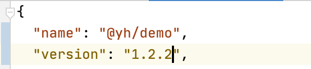
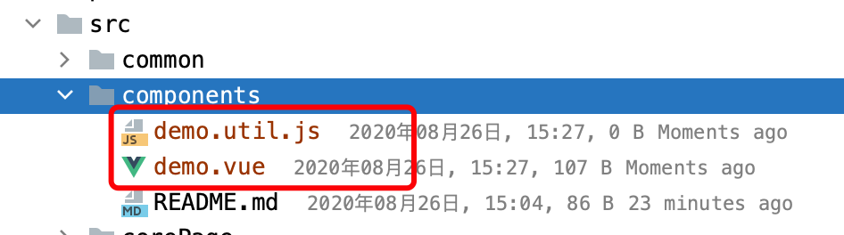
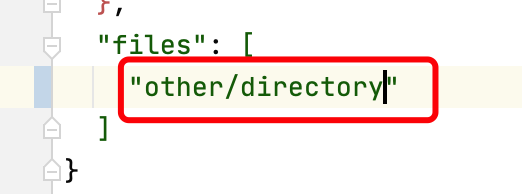
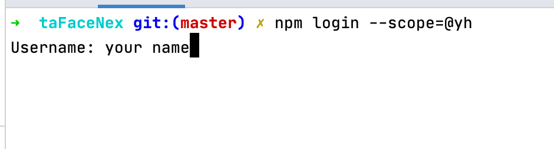
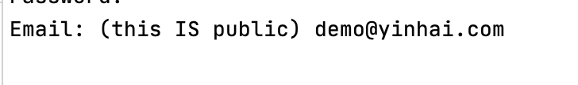
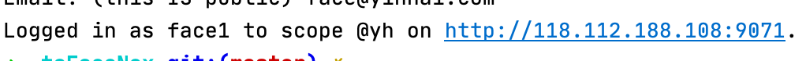
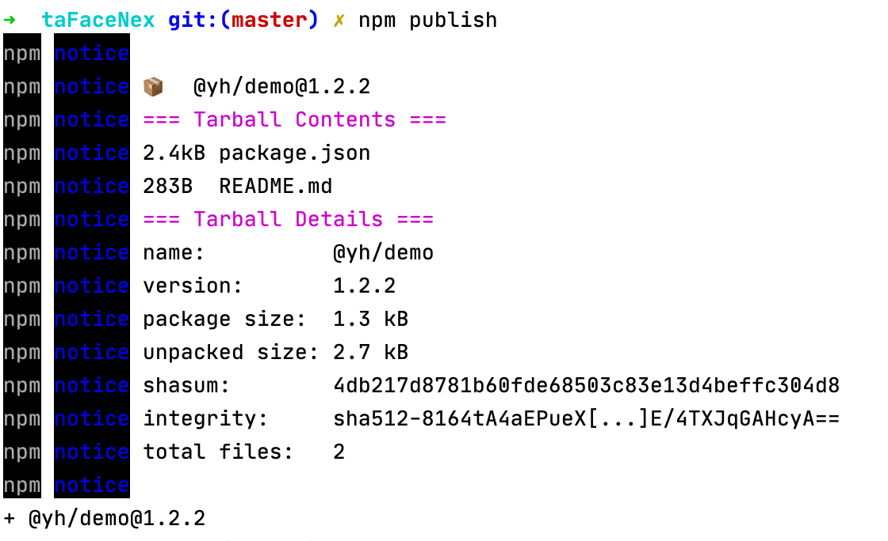
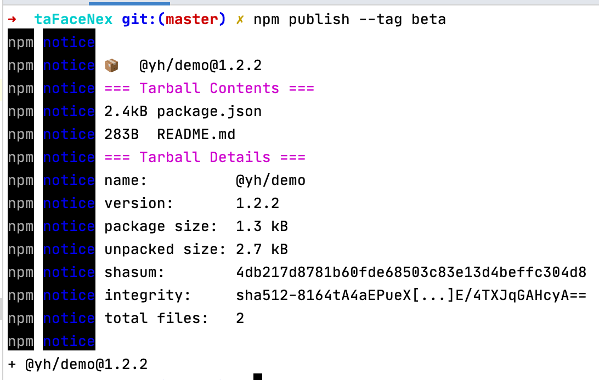

# 在CLI上进行组件开发并发布到公司cnpm仓库

## 组件开发
1. 通过`@yh/face-cli`下载`tta404-ui-cli`项目
1. 修改`package.json`的`name`字段为`@yh/`开头的名称（这个文档中以`@yh/demo`为例）
1. 修改`package.json`的`version`字段为你的组件的版本号（版本号可自定义）

1. 在`src/components`目录下添加自己的组件


    **注意：**
    
    * 如果不想让自己的模块放到`src/components`目录下，那么需要在下载项目后进行下述操作
        1. 修改`package.json`文件的`files`字段，将`src/components`修改为你所希望的目录
        
        1. 其他操作步骤不做变更

## 组件测试
1. 可通过当前项目的任意页面进行组件测试

## cnpm用户创建及登录
1. 确保本机已经配置`@yh/registry`
1. 执行命令`npm login --scope=@yh`
1. 输入你的用户名

    * 若在服务器已存在同名用户，则将使用该账号进行登录
    * 若在服务器不存在同名用户，则将使用该账号进行注册并登录
    
1. 输入密码

    * 若上一步输入的账号存在，则需要输入账号正确的密码
    * 若上一步输入的账号不存在，则此处输入的密码将会作为账号的密码
    
    **注意：** 
    - 请牢记此密码，此密码遗失后无法找回
    
1. 输入邮箱

    * 若第一步输入的账号存在，则需要输入账号注册时的邮箱
    * 若第一步输入的账号不存在，则此处输入的邮箱将会作为账号的邮箱
    
1. 登录/注册成功
    

## 组件发布
1. 在开发、测试完成后，需要发布到cnpm仓库时，在项目根目录执行`npm publish`即可发布到公司的cnpm仓库。


    **注意：**
    - 发布多个不同版本时，版本号必须不一致且需要满足一定规范
    
### 版本号规范
1. 版本号由3位数字组成，例如`1.2.11`，其中的`1`称为主要版本，`2`称为次要版本，`11`称为修订版本
1. 若此次发布的模块只包含bug的修复，那只需要将修订版本进行增加
1. 若此次发布的模块包含bug的修复、新功能的增加、少数功能的重构（兼容旧版本），那么只需要将次要版本增加，修订版本置为0
1. 若此次发布的模块版本包含不兼容旧版本的更新，那么必须将主要版本提升，次要版本和修订版本置为0
1. 对于仅用于测试的beta版本，那么需要在其版本号的后面添加形似`-1`的标注，1代表beta的版本，并且，在发布时需要使用`npm publish --tag beta`进行发布


## 模块使用

1. 在发布到cnpm仓库后，使用者即可通过npm使用你发布的模块。此时模块分为两种类型，用于页面的组件以及用于JS的工具方法

### 用于页面的组件
1. 以`@yh/demo`为例，在使用时，需要从如下路径开始引入

```
import demo from '@yh/demo/src/components/demo.vue'
```
然后在Vue的`components`中进行注册。

### 用于JS的工具类方法
1. 以`@yh/demo`为例，在使用时，需要从如下路径开始引入
```
   import demo from '@yh/demo/src/components/demo.util.js'
```
然后开发者即可在JS中使用你所提供的工具方法。
